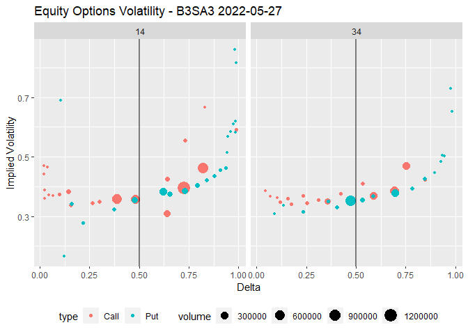

<!-- README.md is generated from README.Rmd. Please edit that file -->

# op

<!-- badges: start -->
<!-- badges: end -->

Option Volatility and Pricing Models.

## Installation

You can install the development version of op like so:

``` r
if (!require(devtools)) install.packages("devtools")
devtools::install_github("wilsonfreitas/op")
```

## Examples

### Pricing Equity Options with Black-Scholes-Merton Model

Pricing options with Black-Scholes-Merton Model (BSM Model).

``` r
library(op)

bsmprice(c("call", "put"), c(50, 49, 48, 47), 45, 0.25, 0.13, 0.01, 0.2)
#> [1] 6.5031266 0.2854164 4.7405597 0.6079959
bsmprice("call", 50, 45, 0.25, 0.13, 0.01, seq(0.1, 0.5, 0.1))
#> [1] 6.316558 6.503127 7.012037 7.695351 8.464750
bsmprice("put", 20, 30, 0:4 / 2, 0.15, 0, 0.25)
#> [1] 10.000000  7.882056  6.272936  5.098353  4.203993
```

### Options Implied Volatility

We can get option prices with {rb3} and compute their implied
volatility.

``` r
library(rb3)
library(bizdays)
library(tidyverse)

refdate <- preceding(Sys.Date() - 3, "Brazil/B3")
ch <- cotahist_get(refdate, "daily")
yc <- yc_get(refdate)
op <- cotahist_equity_options_superset(ch, yc)

symbol_ <- "B3SA3"
op1 <- op |>
  filter(
    symbol.underlying == symbol_
  )
maturities <- unique(op1$maturity_date) |> sort()
close_underlying <- op1$close.underlying[1]

op_vol <- op1 |>
  filter(maturity_date %in% maturities[1:2]) |>
  mutate(
    biz_days = bizdays(
      refdate, following(maturity_date, "Brazil/B3"), "Brazil/B3"
    ),
    time_to_maturity = biz_days / 252,
    rate = log(1 + r_252),
    impvol = bsmimpvol(
      close, type, close.underlying, strike, time_to_maturity, rate, 0
    ),
    delta = bsmdelta(
      type, close.underlying, strike, time_to_maturity, rate, 0, impvol
    ),
    adj_delta = ifelse(str_to_lower(type) == "call", delta, 1 + delta)
  ) |>
  select(
    symbol, volume,
    type, close.underlying, strike, time_to_maturity, rate, impvol,
    delta, adj_delta, biz_days, volume
  )
```

``` r
op_vol |>
  filter(!is.na(impvol)) |>
  ggplot(aes(x = adj_delta, y = impvol, colour = type, size = volume)) +
  geom_point() +
  geom_vline(xintercept = 0.5, alpha = 0.5, size = 1) +
  facet_wrap(~ biz_days) +
  theme(legend.position = "bottom") +
  labs(
    x = "Delta", y = "Implied Volatility",
    title = str_glue("Equity Options Volatility - {symbol_} {format(refdate)}")
  )
```



``` r
options(languageserver.formatting_style = function(options) {
  styler::tidyverse_style(
    scope = I(c("indention", "line_breaks", "tokens")),
    indent_by = options$tabSize
  )
})

options(RStudio = TRUE)

options(repos = structure(c(CRAN = "https://cran.rstudio.com/")))

options(radian.auto_indentation = FALSE)

options(radian.insert_new_line = FALSE)

options(radian.auto_match = FALSE)

options(radian.color_scheme = "monokai")
```

``` r
linters: with_defaults(
  line_length_linter(80), 
  commented_code_linter = NULL,
  object_name_linter = NULL,
  object_usage_linter = NULL,
  object_length_linter = NULL
  )
```