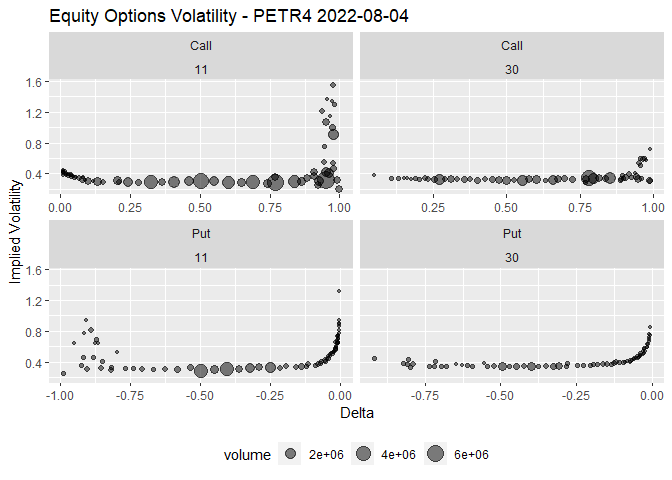
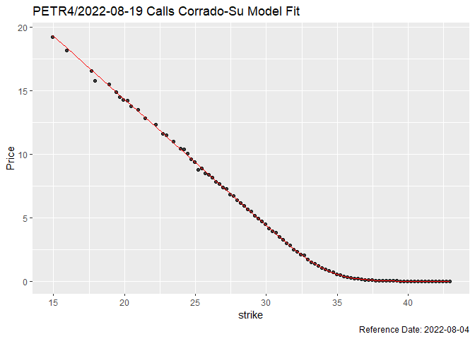

<!-- README.md is generated from README.Rmd. Please edit that file -->

# oplib 

<!-- badges: start -->
<!-- badges: end -->

Option Volatility and Pricing Models.

## Installation

You can install the development version of oplib like so:

``` r
if (!require(devtools)) install.packages("devtools")
devtools::install_github("wilsonfreitas/oplib")
```

## Examples

### Pricing Equity Options with Black-Scholes-Merton Model

Pricing options with Black-Scholes-Merton Model (BSM Model).

``` r
library(oplib)

bsmprice(
  type = "put", spot = 20, strike = 30, time = 1:4 / 2,
  rate = 0.15, yield = 0, sigma = 0.25
)
#> [1] 7.882056 6.272936 5.098353 4.203993
bsmprice(
  type = c("call", "put"), spot = c(50, 49, 48, 47),
  strike = 45, time = 0.25, rate = 0.13, yield = 0.01, sigma = 0.2
)
#> [1] 6.5031266 0.2854164 4.7405597 0.6079959
bsmprice(
  type = "call", spot = 50, strike = 45, time = 0.25, rate = 0.13, yield = 0.01,
  sigma = seq(0.1, 0.5, 0.1)
)
#> [1] 6.316558 6.503127 7.012037 7.695351 8.464750
```

Works nicely with {tidyverse}.

``` r
library(tidyverse)

tibble(
  type = "call",
  spot = 100,
  strike = seq(90, 110, 5),
  time = 0.5,
  rate = 0.02,
  yield = 0,
  sigma = 0.2
) |> mutate(
  price = bsmprice(type, spot, strike, time, rate, yield, sigma),
  delta = bsmdelta(type, spot, strike, time, rate, yield, sigma),
  gamma = bsmgamma(type, spot, strike, time, rate, yield, sigma),
  rho = bsmrho(type, spot, strike, time, rate, yield, sigma),
  vega = bsmvega(type, spot, strike, time, rate, yield, sigma),
  theta = bsmtheta(type, spot, strike, time, rate, yield, sigma),
)
#> # A tibble: 5 x 13
#>   type   spot strike  time  rate yield sigma price delta  gamma   rho  vega theta
#>   <chr> <dbl>  <dbl> <dbl> <dbl> <dbl> <dbl> <dbl> <dbl>  <dbl> <dbl> <dbl> <dbl>
#> 1 call    100     90   0.5  0.02     0   0.2 12.5  0.812 0.0190  34.4  19.0 -5.18
#> 2 call    100     95   0.5  0.02     0   0.2  8.95 0.693 0.0248  30.2  24.8 -6.18
#> 3 call    100    100   0.5  0.02     0   0.2  6.12 0.556 0.0279  24.8  27.9 -6.58
#> 4 call    100    105   0.5  0.02     0   0.2  3.99 0.419 0.0276  19.0  27.6 -6.29
#> 5 call    100    110   0.5  0.02     0   0.2  2.47 0.297 0.0245  13.6  24.5 -5.44
```

### Pricing Equity Options with Corrado-Su Model

Corrado-Su model introduces skewness and kurtosis to option pricing
formula.

``` r
tibble(
  type = "call",
  spot = seq(70, 130, 1),
  strike = 100,
  time = 0.5,
  rate = 0.02,
  yield = 0,
  sigma = 0.2
) |>
  mutate(
    bsm_price = bsmprice(type, spot, strike, time, rate, yield, sigma),
    csm_price = csmprice(type, spot, strike, time, rate, yield, sigma, -0.5, 6)
  ) |>
  tidyr::pivot_longer(
    cols = ends_with("price"),
    names_to = "model",
    values_to = "price"
  ) |>
  ggplot(aes(x = spot, y = price, color = model)) +
  geom_line()
```


See that Corrado-Su modelo is cheaper than Black-Scholes for ATM options
and expensive for OTM and ITM, as a consequence of the kurtosis.

### Options Implied Volatility

We can get option prices with {rb3} and compute their implied
volatility. Let’s start getting all PETR4 optoins.

``` r
library(rb3)
library(bizdays)
library(tidyverse)

refdate <- preceding(Sys.Date() - 3, "Brazil/B3")
ch <- cotahist_get(refdate, "daily")
yc <- yc_get(refdate)
op <- cotahist_equity_options_superset(ch, yc)

symbol_ <- "PETR4"
op1 <- op |>
  filter(
    symbol.underlying == symbol_
  )
```

Filter the first two available maturities.

``` r
maturities <- unique(op1$maturity_date) |> sort()

op1 <- op1 |>
  filter(maturity_date %in% maturities[1:2])
```

Compute implied volatility and delta of the options. Note that it is
necessary to:

-   compute business days `biz_days` to get `time_to_maturity` in years
-   convert interest rate (`rate` column) to continuous rate

``` r
op_vol <- op1 |>
  mutate(
    biz_days = bizdays(
      refdate, following(maturity_date, "Brazil/B3"), "Brazil/B3"
    ),
    time_to_maturity = biz_days / 252,
    rate = log(1 + r_252),
    impvol = bsmimpvol(
      close, type, close.underlying, strike, time_to_maturity, rate, 0
    ),
    delta = bsmdelta(
      type, close.underlying, strike, time_to_maturity, rate, 0, impvol
    )
  )
```

Visualize with {ggplot2}

``` r
op_vol |>
  filter(!is.na(impvol)) |>
  ggplot(aes(x = delta, y = impvol, size = volume)) +
  geom_point(alpha = 0.5) +
  facet_wrap(type ~ biz_days, scales = "free_x") +
  theme(legend.position = "bottom") +
  labs(
    x = "Delta", y = "Implied Volatility",
    title = str_glue("Equity Options Volatility - {symbol_} {format(refdate)}")
  )
```



### Fit Corrado-Su Model to Options Prices

Use options prices to find the parameters of Corrado-Su model. The
function `csm_fit_min_price` executes the fit by minimizing the
difference between the given prices and prices returned by the formula.

Execute the fit only for the first maturity **call** options and see the
result (fitted parameters) in the end.

``` r
params <- with(op_vol |> filter(type == "Call", maturity_date == maturities[1]), {
  csm_fit_min_price(
    par = c(0.1, 0, 3),
    type, close.underlying, strike, rate, 0, time_to_maturity, close, 1,
    control = list(trace = 3)
  )
})
#> N = 3, M = 5 machine precision = 2.22045e-16
#> This problem is unconstrained.
#> At X0, 0 variables are exactly at the bounds
#> At iterate     0  f=       3.9264  |proj g|=       18.082
#> At iterate    10  f =      0.97023  |proj g|=        1.3768
#> At iterate    20  f =      0.88965  |proj g|=      0.028646
#> 
#> iterations 25
#> function evaluations 47
#> segments explored during Cauchy searches 1
#> BFGS updates skipped 0
#> active bounds at final generalized Cauchy point 0
#> norm of the final projected gradient 1.88873e-05
#> final function value 0.889647
#> 
#> F = 0.889647
#> final  value 0.889647 
#> converged

params
#>      sigma        mu3        mu4 
#>  0.3075525 -0.0836883  4.4146539
```

Compute the theoretical price with Corrado-Su model.

``` r
op_csm_call <- op_vol |>
  filter(type == "Call", maturity_date == maturities[1]) |>
  mutate(
    theo_price = csmprice(
      type, close.underlying, strike, time_to_maturity, rate, 0,
      as.numeric(params[1]), as.numeric(params[2]), as.numeric(params[3])
    )
  )
```

Visualize the given prices and model together in a plot.

``` r
op_csm_call |>
  ggplot(aes(x = strike, y = close)) +
  geom_point(alpha = 0.75) +
  geom_line(aes(y = theo_price), colour = "red") +
  labs(
    y = "Price",
    title = str_glue("{symbol_}/{format(maturities[1])} Calls Corrado-Su Model Fit"),
    caption = str_glue("Reference Date: {format(refdate)}")
  ) +
  theme(legend.position = "none")
```



An interesting view is the relative error.

``` r
op_csm_call |>
  ggplot(aes(x = delta, y = (close - theo_price) / close), size = volume) +
  geom_point(alpha = 0.75) +
  labs(
    y = "Error",
    title = str_glue("{symbol_}/{format(maturities[1])} Calls Corrado-Su Model Fit Error"),
    caption = str_glue("Reference Date: {format(refdate)}")
  ) +
  scale_y_continuous(labels = scales::percent)
#> Warning: Removed 26 rows containing missing values (geom_point).
```


It is clear that OTM options have the greater error, mainly due to their
small prices.
